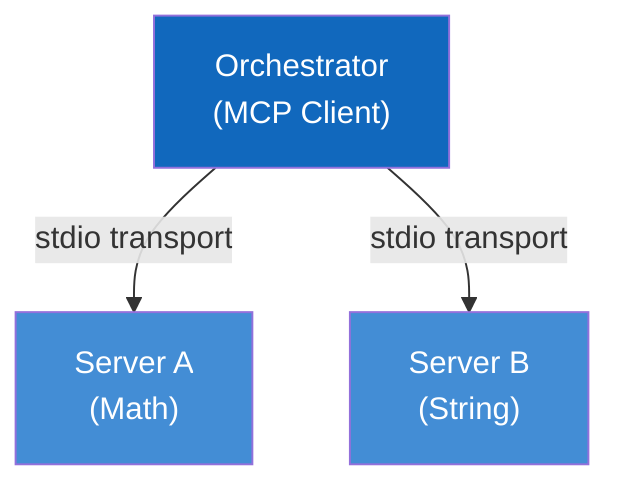

# MCP Test - Multi-Server Orchestration (Learning Exercise)

A hands-on learning project for the **Model Context Protocol (MCP)** with Python. This project demonstrates how a central Orchestrator communicates with multiple MCP Servers to execute tools.

## Learning Objectives

By completing this exercise, you will learn:

- How to create MCP servers using the Python SDK
- How to define tools with JSON Schema
- How to route and execute tool calls
- How an orchestrator coordinates multiple servers

## Exercise Structure

| Component         | Difficulty   | Description                                                          |
| ----------------- | ------------ | -------------------------------------------------------------------- |
| Server A (Math)   | Beginner     | Partially complete - fill in the `_multiply` method                  |
| Server B (String) | Intermediate | Mostly incomplete - implement tool definitions, routing, and methods |
| Orchestrator      | Reference    | Complete implementation - study this to understand the client side   |

## Quick Start

1. Complete the TODOs in [src/server_a/server.py](src/server_a/server.py) (easier)
2. Complete the TODOs in [src/server_b/server.py](src/server_b/server.py) (harder)
3. Run tests to verify: `pytest tests/ -v`
4. Check your work against [solutions/](solutions/) folder

---

## Architecture Overview



- **Orchestrator**: Connects to servers, discovers tools, and executes them
- **Server A**: Provides mathematical operations (`add`, `multiply`)
- **Server B**: Provides string formatting (`uppercase`, `concat`)

---

## Prerequisites

- Python 3.10 or higher
- pip (Python package manager)

---

## Setup Instructions

### 1. Clone the Repository

```bash
git clone https://github.com/Adamo-97/mcp_test.git
cd mcp_test
```

### 2. Create Virtual Environment

```bash
# Windows
python -m venv venv
venv\Scripts\activate

# macOS/Linux
python3 -m venv venv
source venv/bin/activate
```

### 3. Install Dependencies

```bash
pip install -r requirements.txt
```

---

## Project Structure

```
mcp_test/
├── .github/
│   └── workflows/
│       └── ci.yml              # GitHub Actions CI pipeline
├── docs/
│   ├── arch42/                 # Arc42 architecture documentation
│   │   ├── 01_introduction_and_goals.md
│   │   └── 05_building_block_view.md
│   └── c4/
│       └── c4_model.md         # C4 model with Mermaid diagrams
├── solutions/                  # SPOILER: Complete implementations
│   ├── server_a_solution.py    # Solution for Server A
│   └── server_b_solution.py    # Solution for Server B
├── src/
│   ├── orchestrator/
│   │   ├── __init__.py
│   │   └── main.py             # MCP Client (complete - for reference)
│   ├── server_a/
│   │   ├── __init__.py
│   │   └── server.py           # EXERCISE: Math Server (beginner)
│   └── server_b/
│       ├── __init__.py
│       └── server.py           # EXERCISE: String Server (intermediate)
├── tests/
│   ├── __init__.py
│   └── test_integration.py     # Integration tests (use to verify)
├── task.md                     # Exercise requirements
├── README.md                   # This file
└── requirements.txt            # Python dependencies
```

---

## Running the Application

### Run Individual Servers (for testing)

```bash
# Start Server A (Math)
python -m src.server_a.server

# Start Server B (String)
python -m src.server_b.server
```

### Run the Orchestrator Demo

```bash
python -m src.orchestrator.main
```

This will:

1. Connect to both MCP servers
2. Discover available tools
3. Execute a demo workflow
4. Display aggregated results

---

## Running Tests

### Run All Tests

```bash
pytest tests/ -v
```

### Run with Coverage

```bash
pytest tests/ -v --cov=src --cov-report=term-missing
```

---

## Running CI Locally

You can simulate the GitHub Actions CI pipeline locally:

```bash
# Install dependencies
pip install -r requirements.txt

# Run linting (optional)
pip install flake8
flake8 src/ tests/ --max-line-length=100

# Run type checking (optional)
pip install mypy
mypy src/ --ignore-missing-imports

# Run tests
pytest tests/ -v
```

---

## MCP Concepts Demonstrated

### 1. Server Initialization

Each server initializes the MCP SDK and registers tools with metadata.

### 2. Tool Registration

Tools are registered with:

- Name and description
- Input schema (JSON Schema)
- Handler function

### 3. Stdio Transport

Servers communicate via stdin/stdout using the stdio transport layer.

### 4. Client Connection

The Orchestrator spawns server processes and establishes MCP sessions.

### 5. Tool Discovery

Clients call `list_tools()` to discover available tools from servers.

### 6. Tool Execution

Clients call tools by name with arguments and receive structured results.

---

## Learning Resources

- [Model Context Protocol Specification](https://modelcontextprotocol.io/)
- [MCP Python SDK](https://github.com/modelcontextprotocol/python-sdk)
- [Arc42 Template](https://arc42.org/)
- [C4 Model](https://c4model.com/)

---

## License

This project is for educational purposes. See [LICENSE](LICENSE) for details.
