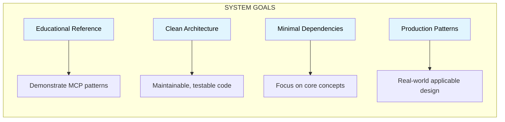

# 1. Introduction and Goals

## 1.1 Requirements Overview

This system demonstrates the **Model Context Protocol (MCP)** architecture pattern where a central client (Orchestrator) communicates with multiple specialized servers to perform distributed tasks.

### Functional Requirements

| ID    | Requirement                                                   | Priority |
| ----- | ------------------------------------------------------------- | -------- |
| FR-01 | Orchestrator connects to multiple MCP servers                 | High     |
| FR-02 | Server A provides mathematical tools (add, multiply)          | High     |
| FR-03 | Server B provides string formatting tools (uppercase, concat) | High     |
| FR-04 | Orchestrator discovers tools from all connected servers       | High     |
| FR-05 | Orchestrator executes tools and aggregates results            | High     |

### Quality Goals

| Priority | Quality Goal     | Description                                           |
| -------- | ---------------- | ----------------------------------------------------- |
| 1        | **Learnability** | Code should be easy to understand for Python learners |
| 2        | **Modularity**   | Each component is independent and testable            |
| 3        | **Type Safety**  | Full type hints for IDE support and documentation     |
| 4        | **Testability**  | All components can be unit and integration tested     |

## 1.2 Stakeholders

| Role                 | Expectations                                     |
| -------------------- | ------------------------------------------------ |
| **Junior Developer** | Clear code examples demonstrating MCP concepts   |
| **Python Learner**   | OOP patterns, type hints, and clean architecture |
| **Team Lead**        | Testable, maintainable reference implementation  |

## 1.3 Technical Context

### Protocol: Model Context Protocol (MCP)

MCP is a standardized protocol for AI-tool communication that defines:

1. **Handshake**: Client-server capability negotiation
2. **Tool Discovery**: Servers expose tools with JSON Schema definitions
3. **Tool Execution**: Structured request/response for tool calls
4. **Transport**: Communication layer (stdio, HTTP, etc.)

### Transport: Standard I/O (stdio)

This implementation uses stdio transport where:

- The Orchestrator spawns server processes
- Communication happens via stdin/stdout pipes
- JSON-RPC 2.0 messages are exchanged

## 1.4 Goals and Driving Forces

## 1.5 Solution Strategy

| Goal        | Strategy                                     |
| ----------- | -------------------------------------------- |
| Educational | Extensive comments, simple algorithms        |
| Modularity  | Separate packages for each server and client |
| Testability | Dependency injection, subprocess isolation   |
| Type Safety | Python 3.10+ type hints, runtime validation  |
