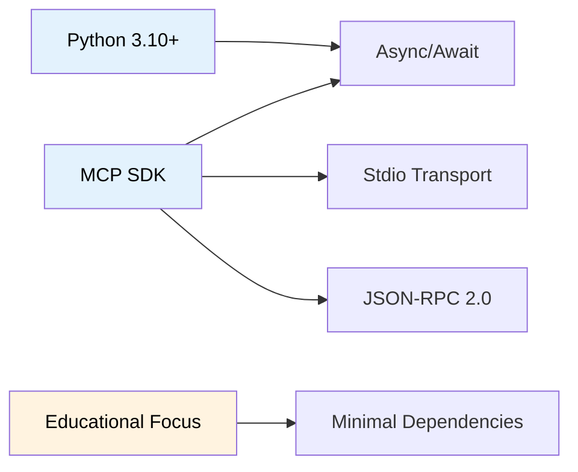

# 2. Constraints

This section describes the technical, organizational, and regulatory constraints that influence the architecture.

---

## 2.1 Technical Constraints

| Constraint                | Description                      | Rationale                                   |
| ------------------------- | -------------------------------- | ------------------------------------------- |
| **TC-01** Python 3.10+    | Minimum Python version required  | Type hints with union syntax (`X \| Y`)     |
| **TC-02** MCP SDK         | Must use official MCP Python SDK | Protocol compliance and compatibility       |
| **TC-03** Stdio Transport | Communication via stdin/stdout   | Simplicity, no network configuration needed |
| **TC-04** JSON-RPC 2.0    | Message format for MCP protocol  | MCP specification requirement               |
| **TC-05** Async/Await     | Asynchronous programming model   | MCP SDK is async-first                      |

---

## 2.2 Organizational Constraints

| Constraint                     | Description                               | Rationale                       |
| ------------------------------ | ----------------------------------------- | ------------------------------- |
| **OC-01** Educational Focus    | Code must be readable and well-documented | Target audience is learners     |
| **OC-02** Minimal Dependencies | Only essential packages allowed           | Reduce complexity for students  |
| **OC-03** Single Repository    | All components in one repo                | Simplified setup and navigation |
| **OC-04** Open Source          | MIT License                               | Educational sharing             |

---

## 2.3 Conventions

| Convention | Description                              |
| ---------- | ---------------------------------------- |
| **CV-01**  | PEP 8 style guide for Python code        |
| **CV-02**  | Type hints on all public functions       |
| **CV-03**  | Docstrings in Google format              |
| **CV-04**  | Arc42 for architecture documentation     |
| **CV-05**  | C4 model for visual diagrams             |
| **CV-06**  | Conventional commits for version control |

---

## 2.4 Constraint Dependencies

