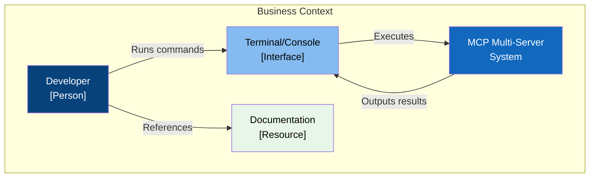
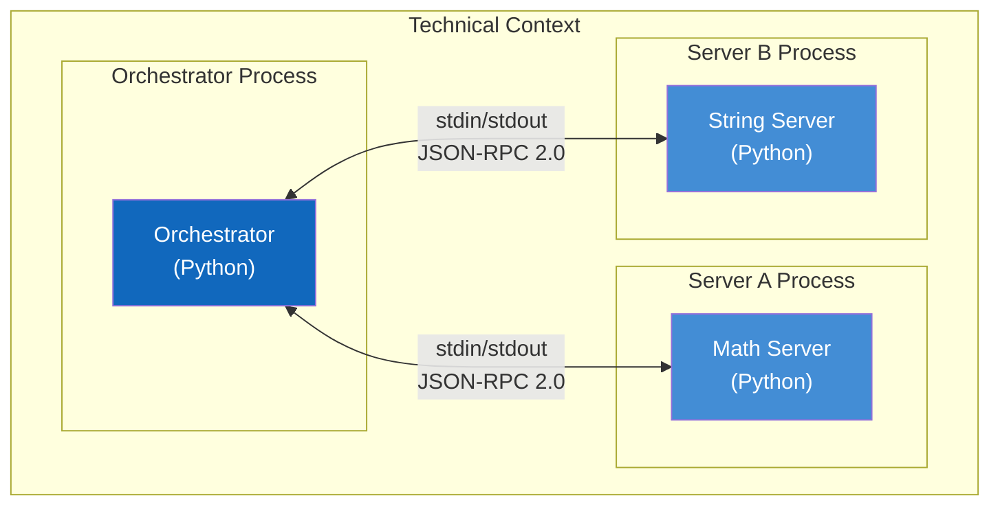

# 3. Context and Scope

This section defines the boundaries of the system and describes its external interfaces.

---

## 3.1 Business Context

The MCP Multi-Server System operates within a learning/development environment where developers explore the Model Context Protocol.

### Business Partners and Interfaces

| Partner       | Interface      | Description                 |
| ------------- | -------------- | --------------------------- |
| Developer     | CLI / Terminal | Primary interaction point   |
| CI System     | GitHub Actions | Automated testing           |
| Documentation | Markdown files | Architecture and usage docs |

---

## 3.2 Technical Context

The system uses stdio transport for inter-process communication between the orchestrator and MCP servers.

### Technical Interfaces

| Interface                | Protocol | Format       | Description       |
| ------------------------ | -------- | ------------ | ----------------- |
| Orchestrator to Server A | stdio    | JSON-RPC 2.0 | Math tool calls   |
| Orchestrator to Server B | stdio    | JSON-RPC 2.0 | String tool calls |
| User to Orchestrator     | CLI      | Text         | Command execution |

---

## 3.3 External Interfaces

### Input Interfaces

| Interface      | Type         | Data Format         |
| -------------- | ------------ | ------------------- |
| Command Line   | User Input   | Shell commands      |
| Tool Arguments | Programmatic | Python dictionaries |

### Output Interfaces

| Interface      | Type         | Data Format       |
| -------------- | ------------ | ----------------- |
| Console Output | Text         | Formatted strings |
| Tool Results   | Programmatic | MCP TextContent   |
| Test Reports   | File         | pytest output     |
