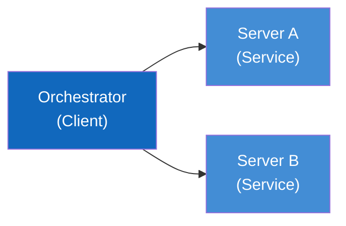
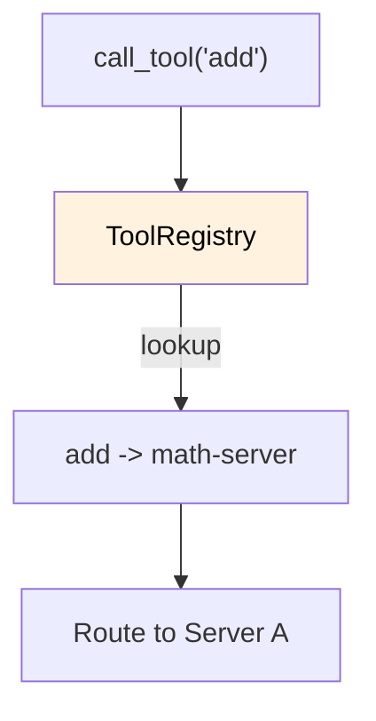

# 4. Solution Strategy

This section describes the fundamental decisions and solution strategies that shape the system architecture.

---

## 4.1 Technology Decisions

| Decision                 | Choice                       | Rationale                                              |
| ------------------------ | ---------------------------- | ------------------------------------------------------ |
| **Programming Language** | Python 3.10+                 | Modern type hints, async support, MCP SDK availability |
| **Protocol**             | MCP (Model Context Protocol) | Standardized AI-tool communication                     |
| **Transport**            | stdio                        | Simple, no network config, subprocess isolation        |
| **Testing**              | pytest + pytest-asyncio      | Industry standard, async test support                  |
| **CI/CD**                | GitHub Actions               | Native GitHub integration                              |

---

## 4.2 Architecture Patterns

### 4.2.1 Client-Server Pattern

The system uses a client-server architecture where:

- **Orchestrator** acts as the client
- **MCP Servers** act as specialized service providers

### 4.2.2 Registry Pattern

The ToolRegistry maintains a mapping of tool names to their source servers, enabling transparent routing.

### 4.2.3 Subprocess Isolation

Each MCP server runs in its own subprocess, providing:

- Process isolation
- Independent failure handling
- Clean resource management

---

## 4.3 Quality Strategies

| Quality Goal     | Strategy                                                  |
| ---------------- | --------------------------------------------------------- |
| **Learnability** | Extensive docstrings, simple algorithms, clear naming     |
| **Modularity**   | Separate packages per component, single responsibility    |
| **Type Safety**  | Full type hints, dataclasses for structured data          |
| **Testability**  | Dependency injection, pytest fixtures, async test support |

---

## 4.4 Organizational Decisions

| Decision                | Description                                        |
| ----------------------- | -------------------------------------------------- |
| **Monorepo**            | All components in single repository for simplicity |
| **Documentation-First** | Arc42 + C4 documentation before complex features   |
| **Test-Driven**         | Integration tests verify end-to-end functionality  |

---

## 4.5 Key Design Decisions

1. **Async-First**: All MCP operations use async/await for non-blocking I/O
2. **Dataclasses for DTOs**: ServerConfig, ToolInfo use dataclasses for clarity
3. **Context Managers**: Proper resource cleanup with async context managers
4. **Explicit Over Implicit**: Clear function signatures, no magic behavior
