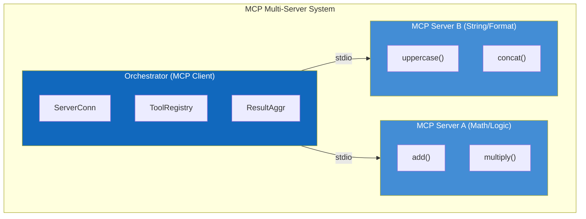
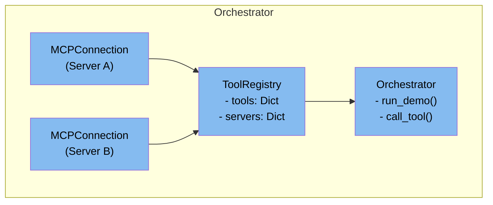
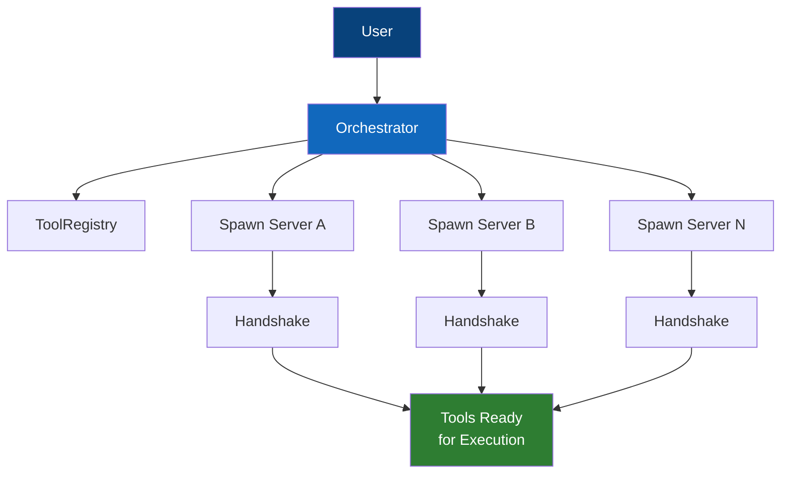

# 5. Building Block View

## 5.1 Whitebox Overall System

The system is decomposed into three main building blocks connected via the MCP protocol over stdio transport.

## 5.2 Level 1: Building Blocks

### 5.2.1 Orchestrator (MCP Client)

**Purpose**: Central coordinator that manages connections to MCP servers and executes tools.

**Responsibilities**:

- Spawn and manage server processes
- Establish MCP sessions with each server
- Discover available tools from all servers
- Execute tool calls and handle responses
- Aggregate results from multiple servers

**Interfaces**:
| Interface | Type | Description |
|-----------|------|-------------|
| `connect()` | Method | Establishes connections to all servers |
| `list_tools()` | Method | Returns all available tools from all servers |
| `call_tool()` | Method | Executes a specific tool by name |
| `disconnect()` | Method | Gracefully closes all connections |

**Files**: `src/orchestrator/main.py`

---

### 5.2.2 MCP Server A (Math/Logic)

**Purpose**: Provides mathematical computation tools via MCP.

**Responsibilities**:

- Register mathematical tools with MCP SDK
- Handle tool execution requests
- Return computed results in MCP format

**Exposed Tools**:
| Tool | Signature | Description |
|------|-----------|-------------|
| `add` | `(a: int, b: int) -> int` | Adds two integers |
| `multiply` | `(a: int, b: int) -> int` | Multiplies two integers |

**Files**: `src/server_a/server.py`

---

### 5.2.3 MCP Server B (String/Format)

**Purpose**: Provides string manipulation tools via MCP.

**Responsibilities**:

- Register string tools with MCP SDK
- Handle text transformation requests
- Return formatted strings in MCP format

**Exposed Tools**:
| Tool | Signature | Description |
|------|-----------|-------------|
| `uppercase` | `(text: str) -> str` | Converts text to uppercase |
| `concat` | `(a: str, b: str, separator: str) -> str` | Joins strings with separator |

**Files**: `src/server_b/server.py`

---

## 5.3 Level 2: Orchestrator Internal Structure

### Components

| Component         | Responsibility                                         |
| ----------------- | ------------------------------------------------------ |
| **MCPConnection** | Wraps subprocess and MCP client session for one server |
| **ToolRegistry**  | Maps tool names to their source servers                |
| **Orchestrator**  | High-level API for demo and tool execution             |

## 5.4 Data Flow

## 5.5 Technology Mapping

| Building Block | Technology               |
| -------------- | ------------------------ |
| Orchestrator   | Python 3.10+, `mcp` SDK  |
| MCP Servers    | Python 3.10+, `mcp` SDK  |
| Transport      | stdio (subprocess pipes) |
| Message Format | JSON-RPC 2.0             |
| Testing        | pytest                   |
| CI/CD          | GitHub Actions           |
