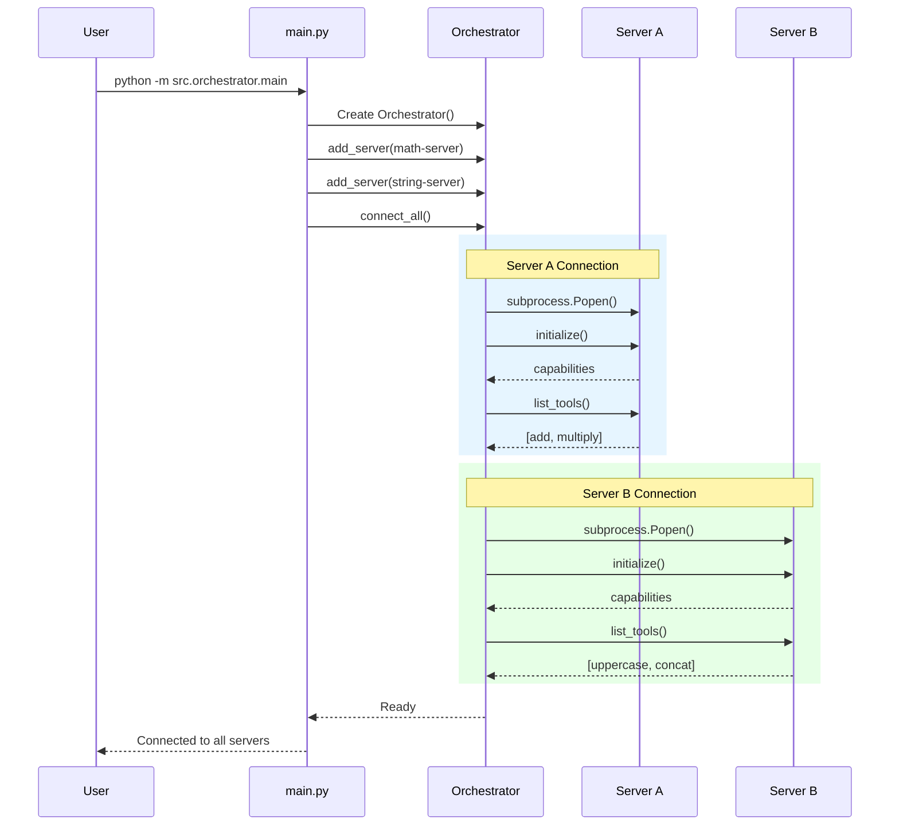
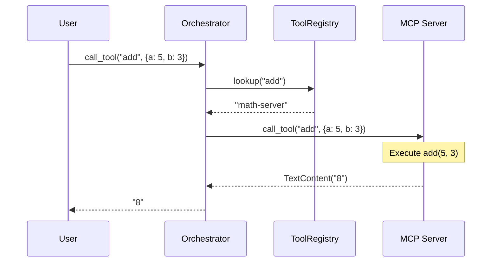
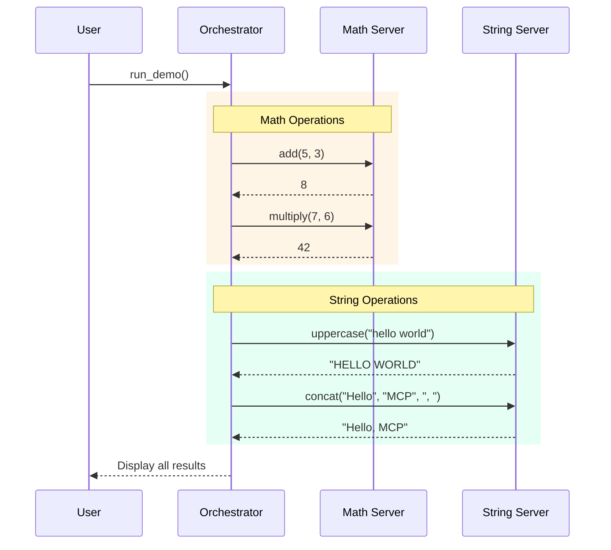
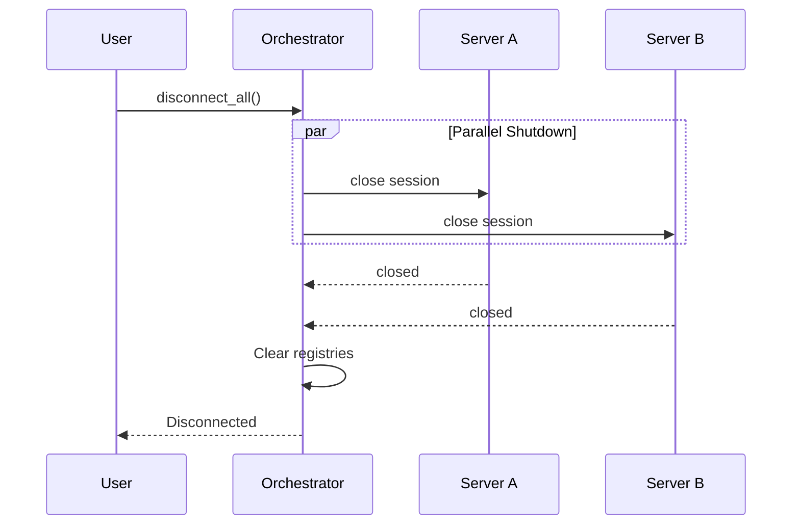
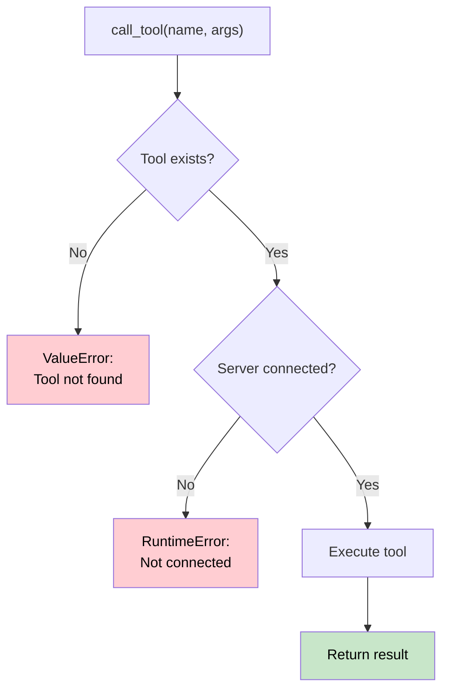

# 6. Runtime View

This section describes the behavior and interaction of building blocks during runtime.

---

## 6.1 Startup Sequence

The system initialization follows a specific sequence to ensure all components are ready.

---

## 6.2 Tool Execution Flow

When a tool is called, the orchestrator routes it to the appropriate server.

---

## 6.3 Demo Workflow

The full demo workflow demonstrates all system capabilities.

---

## 6.4 Shutdown Sequence

Graceful shutdown ensures all resources are properly released.

---

## 6.5 Error Handling

The system handles various error conditions gracefully.

