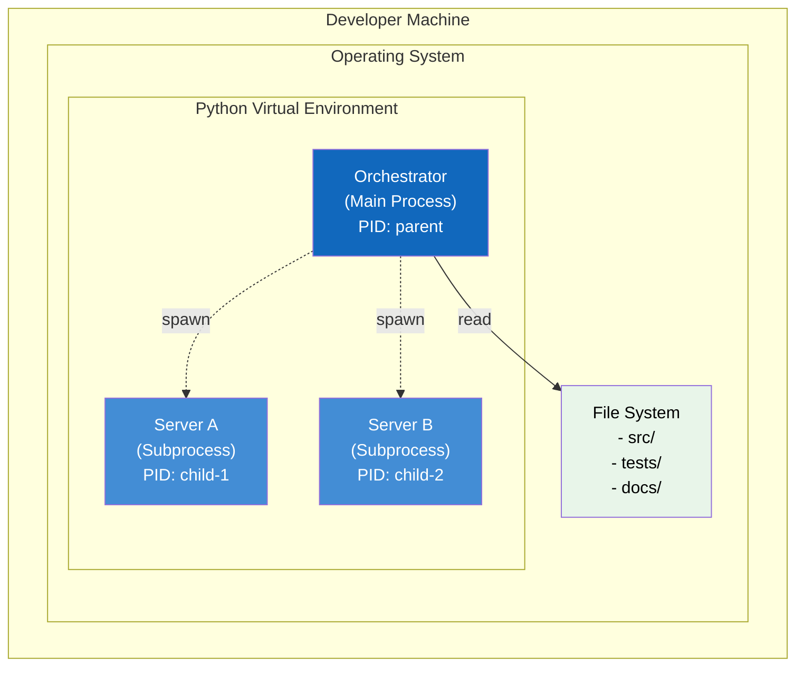
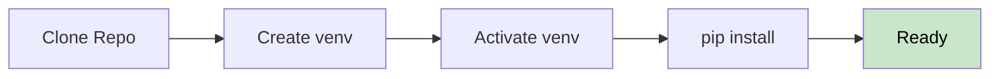
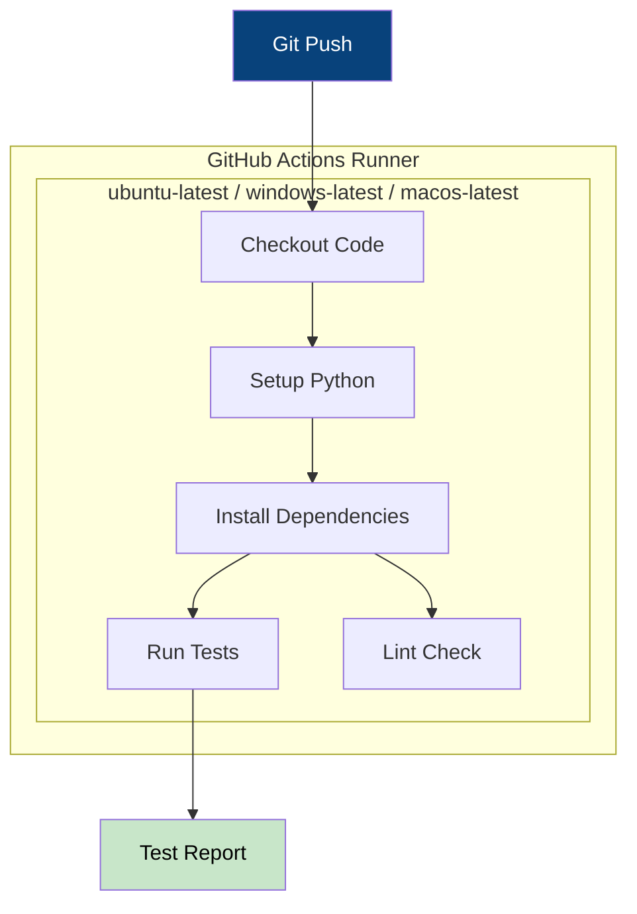
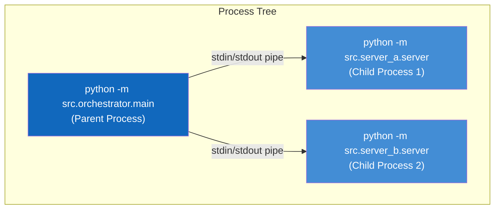

# 7. Deployment View

This section describes the technical infrastructure and how the system components are deployed.

---

## 7.1 Infrastructure Overview

The MCP Multi-Server System runs entirely on the local developer machine without external dependencies.

---

## 7.2 Development Environment

### Requirements

| Component        | Requirement              |
| ---------------- | ------------------------ |
| Operating System | Windows, macOS, or Linux |
| Python           | 3.10 or higher           |
| pip              | Latest version           |
| Git              | For version control      |

### Setup Steps

---

## 7.3 CI/CD Pipeline

GitHub Actions provides the continuous integration environment.

---

## 7.4 Process Architecture

---

## 7.5 Resource Requirements

| Resource | Minimum      | Recommended  |
| -------- | ------------ | ------------ |
| RAM      | 256 MB       | 512 MB       |
| Disk     | 50 MB        | 100 MB       |
| CPU      | 1 core       | 2 cores      |
| Network  | Not required | Not required |

---

## 7.6 Deployment Artifacts

| Artifact      | Location             | Description       |
| ------------- | -------------------- | ----------------- |
| Source Code   | `src/`               | Python modules    |
| Tests         | `tests/`             | pytest test files |
| Documentation | `docs/`              | Architecture docs |
| Dependencies  | `requirements.txt`   | pip packages      |
| CI Config     | `.github/workflows/` | GitHub Actions    |
