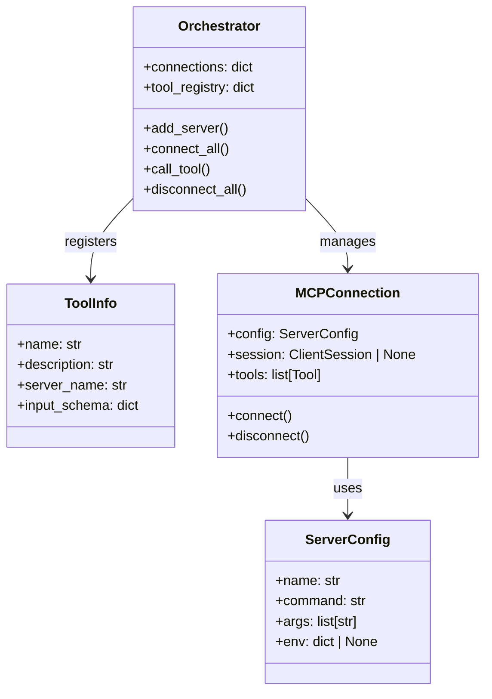
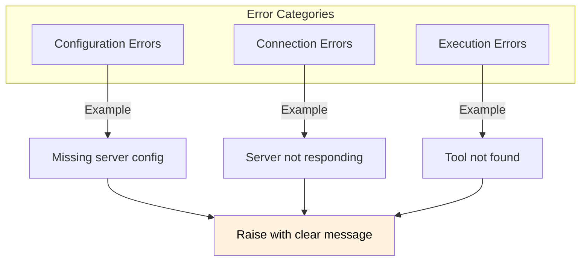

# 8. Crosscutting Concepts

This section describes overall concepts that apply across multiple building blocks.

---

## 8.1 Domain Model

The core domain concepts used throughout the system.



---

## 8.2 Type Safety

All public interfaces use Python type hints for clarity and IDE support.

### Type Hint Patterns

```python
# Function signatures with full typing
async def call_tool(self, tool_name: str, arguments: dict[str, Any]) -> str:
    ...

# Dataclasses for structured data
@dataclass
class ServerConfig:
    name: str
    command: str
    args: list[str]
    env: dict[str, str] | None = None

# Optional types using union syntax (Python 3.10+)
session: ClientSession | None = None
```

---

## 8.3 Error Handling Strategy

Errors are handled consistently across all components.



### Exception Hierarchy

| Exception      | When Raised       | Handling            |
| -------------- | ----------------- | ------------------- |
| `ValueError`   | Invalid tool name | User feedback       |
| `RuntimeError` | Not connected     | Re-connect or fail  |
| `KeyError`     | Missing config    | Configuration check |

---

## 8.4 Async Patterns

The system uses async/await consistently for all I/O operations.

### Pattern: Async Context Manager

```python
async with stdio_server() as (read_stream, write_stream):
    await server.run(read_stream, write_stream, options)
```

### Pattern: Async Iterator

```python
async for message in session.incoming_messages:
    await handle_message(message)
```

---

## 8.5 Logging and Observability

Currently minimal logging for educational clarity. In production:

| Aspect  | Current          | Production Recommendation |
| ------- | ---------------- | ------------------------- |
| Logging | print statements | structured logging (JSON) |
| Tracing | None             | OpenTelemetry spans       |
| Metrics | None             | Prometheus counters       |

---

## 8.6 Testing Patterns

### Fixture-based Setup

```python
@pytest_asyncio.fixture
async def orchestrator():
    orch = Orchestrator()
    # ... setup
    await orch.connect_all()
    yield orch
    await orch.disconnect_all()
```

### Test Organization

| Test Class                | Purpose                   |
| ------------------------- | ------------------------- |
| `TestServerConnection`    | Connection establishment  |
| `TestToolDiscovery`       | Tool listing and registry |
| `TestMathTools`           | Math tool execution       |
| `TestStringTools`         | String tool execution     |
| `TestIntegrationWorkflow` | End-to-end scenarios      |

---

## 8.7 Documentation Standards

| Document Type | Format                    | Purpose             |
| ------------- | ------------------------- | ------------------- |
| Code docs     | Docstrings (Google style) | API reference       |
| Architecture  | Markdown + Mermaid        | System design       |
| User guide    | README.md                 | Getting started     |
| Exercise      | task.md                   | Learning objectives |
