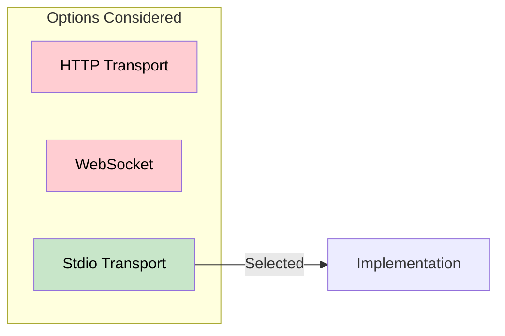

# 9. Architecture Decisions

This section documents significant architecture decisions and their rationale.

---

## ADR-001: Use MCP SDK for Protocol Implementation

### Status

Accepted

### Context

We need to implement the Model Context Protocol for client-server communication.

### Decision

Use the official MCP Python SDK (`mcp` package) rather than implementing the protocol from scratch.

### Consequences

- **Positive**: Protocol compliance guaranteed, reduced development time
- **Positive**: Automatic updates when protocol evolves
- **Negative**: Dependency on external package
- **Negative**: Less control over low-level details

---

## ADR-002: Stdio Transport Over HTTP

### Status

Accepted

### Context

MCP supports multiple transport options: stdio, HTTP, WebSocket.

### Decision

Use stdio transport for all server communication.



### Consequences

- **Positive**: No network configuration needed
- **Positive**: Process isolation via subprocesses
- **Positive**: Simple debugging with pipe inspection
- **Negative**: Cannot scale across machines
- **Negative**: Tight coupling of lifecycle

---

## ADR-003: Dataclasses for Data Transfer Objects

### Status

Accepted

### Context

Need structured types for configuration and tool information.

### Decision

Use Python dataclasses for all DTOs.

```python
@dataclass
class ServerConfig:
    name: str
    command: str
    args: list[str]
    env: dict[str, str] | None = None
```

### Consequences

- **Positive**: Built-in, no external dependency
- **Positive**: Automatic `__init__`, `__repr__`, `__eq__`
- **Positive**: Type hints preserved
- **Negative**: Less validation than Pydantic

---

## ADR-004: Async-First Design

### Status

Accepted

### Context

The MCP SDK uses asyncio for all I/O operations.

### Decision

Design all components as async from the start, not retrofitting later.

### Consequences

- **Positive**: Natural fit with MCP SDK
- **Positive**: Non-blocking I/O throughout
- **Positive**: Better resource utilization
- **Negative**: Requires understanding of async/await
- **Negative**: More complex testing setup

---

## ADR-005: Monorepo Structure

### Status

Accepted

### Context

The system has multiple components (orchestrator, servers).

### Decision

Keep all components in a single repository.

```
mcp_test/
├── src/
│   ├── orchestrator/
│   ├── server_a/
│   └── server_b/
└── tests/
```

### Consequences

- **Positive**: Simplified setup for learners
- **Positive**: Single CI pipeline
- **Positive**: Easy cross-component refactoring
- **Negative**: All components share same version
- **Negative**: Larger repository size

---

## ADR-006: pytest for Testing

### Status

Accepted

### Context

Need a testing framework that supports async tests.

### Decision

Use pytest with pytest-asyncio plugin.

### Consequences

- **Positive**: Industry standard
- **Positive**: Excellent fixture support
- **Positive**: Rich plugin ecosystem
- **Positive**: Native async test support
- **Negative**: Additional dependency

---

## Decision Log

| ID      | Decision             | Date    | Status   |
| ------- | -------------------- | ------- | -------- |
| ADR-001 | Use MCP SDK          | 2026-02 | Accepted |
| ADR-002 | Stdio Transport      | 2026-02 | Accepted |
| ADR-003 | Dataclasses for DTOs | 2026-02 | Accepted |
| ADR-004 | Async-First Design   | 2026-02 | Accepted |
| ADR-005 | Monorepo Structure   | 2026-02 | Accepted |
| ADR-006 | pytest for Testing   | 2026-02 | Accepted |
