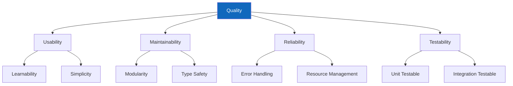
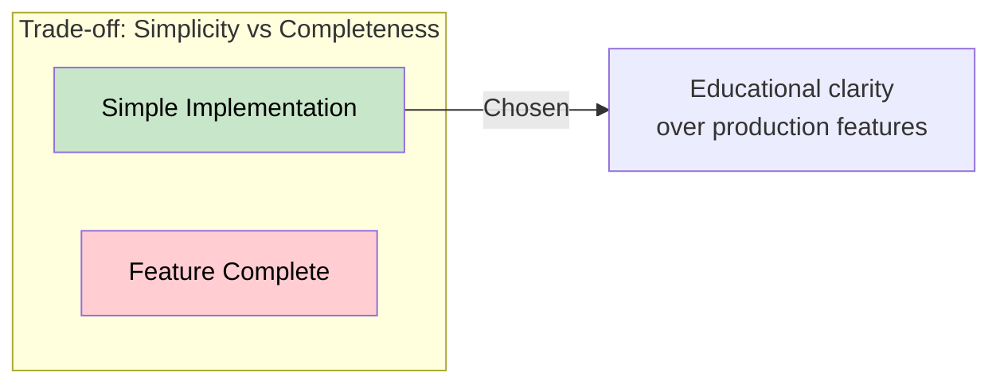

# 10. Quality Requirements

This section specifies the quality requirements that drive architectural decisions.

---

## 10.1 Quality Tree

---

## 10.2 Quality Scenarios

### 10.2.1 Learnability

| ID    | Scenario                                                                             |
| ----- | ------------------------------------------------------------------------------------ |
| Q-1.1 | A junior developer can understand the orchestrator code within 30 minutes of reading |
| Q-1.2 | Each server file is self-contained and understandable independently                  |
| Q-1.3 | Documentation provides clear setup instructions that work on first try               |

### 10.2.2 Modularity

| ID    | Scenario                                                         |
| ----- | ---------------------------------------------------------------- |
| Q-2.1 | A new MCP server can be added without modifying existing servers |
| Q-2.2 | The orchestrator can work with any number of servers (1 to N)    |
| Q-2.3 | Each component can be tested in isolation                        |

### 10.2.3 Type Safety

| ID    | Scenario                                                 |
| ----- | -------------------------------------------------------- |
| Q-3.1 | IDE provides accurate autocompletion for all public APIs |
| Q-3.2 | Type errors are caught before runtime by static analysis |
| Q-3.3 | All function signatures clearly document expected types  |

### 10.2.4 Testability

| ID    | Scenario                                                  |
| ----- | --------------------------------------------------------- |
| Q-4.1 | All integration tests complete within 30 seconds          |
| Q-4.2 | Tests provide clear failure messages when assertions fail |
| Q-4.3 | CI pipeline catches regressions before merge              |

---

## 10.3 Quality Metrics

| Quality Attribute | Metric              | Target                  |
| ----------------- | ------------------- | ----------------------- |
| Learnability      | Lines per function  | < 30                    |
| Learnability      | Docstring coverage  | 100% public APIs        |
| Modularity        | Coupling            | No cross-server imports |
| Type Safety       | Type hint coverage  | 100% public APIs        |
| Testability       | Test coverage       | > 80%                   |
| Testability       | Test execution time | < 30 seconds            |

---

## 10.4 Quality Requirements Matrix

| Requirement      | Priority | Verification Method        |
| ---------------- | -------- | -------------------------- |
| Code readability | High     | Code review, documentation |
| Type safety      | High     | mypy static analysis       |
| Test coverage    | High     | pytest-cov reports         |
| Error handling   | Medium   | Integration tests          |
| Performance      | Low      | Not a primary concern      |

---

## 10.5 Trade-offs

| Trade-off                  | Decision   | Rationale         |
| -------------------------- | ---------- | ----------------- |
| Simplicity vs Features     | Simplicity | Educational focus |
| Performance vs Clarity     | Clarity    | Learning first    |
| Flexibility vs Constraints | Balanced   | Enough for demos  |
