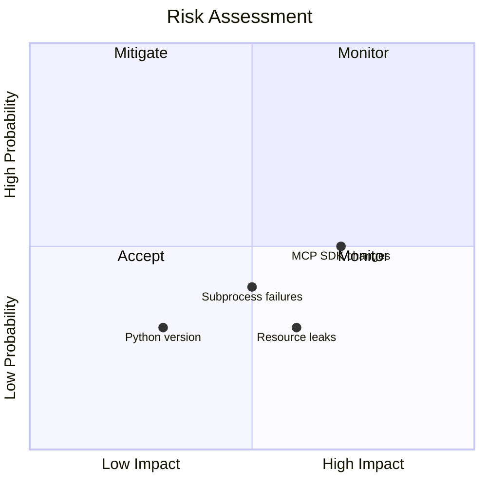
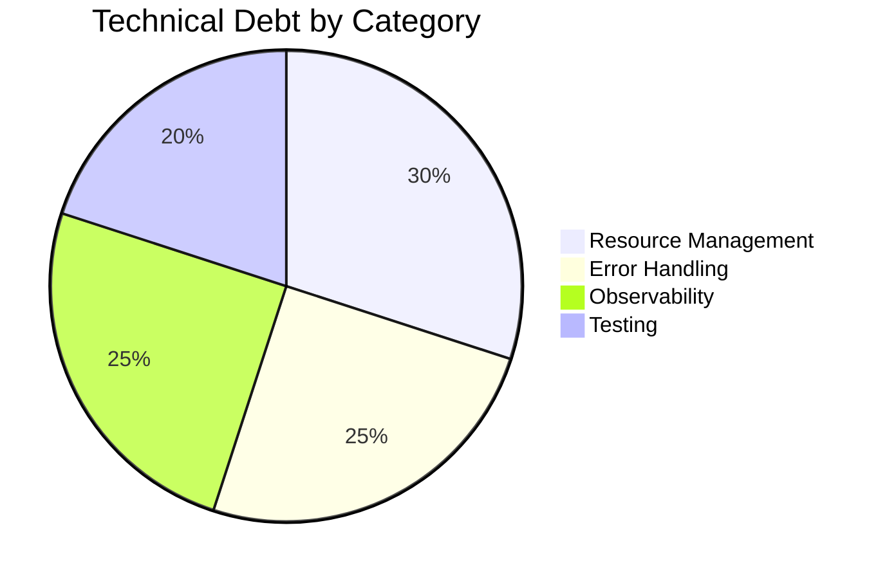
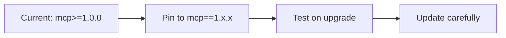
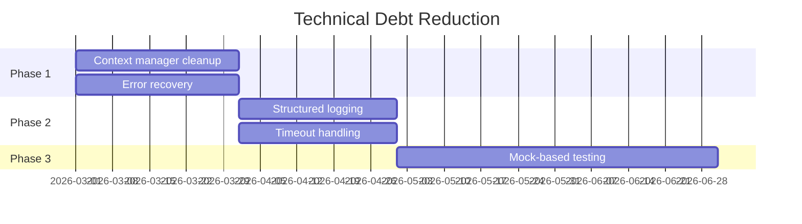

# 11. Risks and Technical Debt

This section identifies known risks and areas of technical debt.

---

## 11.1 Identified Risks

### Risk Matrix



### Risk Details

| ID   | Risk                           | Probability | Impact | Mitigation                       |
| ---- | ------------------------------ | ----------- | ------ | -------------------------------- |
| R-01 | MCP SDK breaking changes       | Medium      | High   | Pin version, monitor releases    |
| R-02 | Python version incompatibility | Low         | Medium | Test on multiple versions in CI  |
| R-03 | Subprocess management failures | Medium      | Medium | Proper cleanup in finally blocks |
| R-04 | Resource leaks on errors       | Low         | High   | Context managers, testing        |
| R-05 | Platform-specific issues       | Low         | Medium | Cross-platform CI testing        |

---

## 11.2 Technical Debt

### Current Debt Items

| ID    | Description                                  | Priority | Effort |
| ----- | -------------------------------------------- | -------- | ------ |
| TD-01 | Context manager cleanup could be more robust | Medium   | Low    |
| TD-02 | No structured logging implementation         | Low      | Medium |
| TD-03 | Limited error recovery options               | Medium   | Medium |
| TD-04 | No timeout handling for tool calls           | Low      | Low    |
| TD-05 | Tests depend on real subprocess spawning     | Medium   | High   |

### Debt Visualization



---

## 11.3 Mitigation Strategies

### R-01: MCP SDK Breaking Changes



**Actions**:

1. Pin specific version in production
2. Subscribe to MCP SDK release notifications
3. Test upgrades in isolated branch

### R-03: Subprocess Management

**Current Implementation**:

```python
# Cleanup in disconnect_all()
for server_name, (stdio_transport, session, _) in self._active_sessions.items():
    try:
        await session.__aexit__(None, None, None)
        await stdio_transport.__aexit__(None, None, None)
    except Exception:
        pass  # Best effort cleanup
```

**Improvement**:

- Add timeout to cleanup operations
- Log cleanup failures
- Consider using structured async context management

---

## 11.4 Known Limitations

| Limitation             | Impact      | Workaround                        |
| ---------------------- | ----------- | --------------------------------- |
| No parallel tool calls | Performance | Sequential is acceptable for demo |
| Single tool per call   | Flexibility | Multiple calls work fine          |
| No tool result caching | Performance | Not needed for educational use    |
| Stdio only transport   | Scalability | Sufficient for local development  |

---

## 11.5 Future Improvements

| Priority | Improvement                              | Benefit                     |
| -------- | ---------------------------------------- | --------------------------- |
| High     | Add proper async context manager pattern | Better resource management  |
| Medium   | Implement structured logging             | Debugging and observability |
| Medium   | Add tool call timeout                    | Prevent hanging             |
| Low      | HTTP transport option                    | Network deployment          |
| Low      | Result caching                           | Performance                 |

---

## 11.6 Debt Reduction Plan


