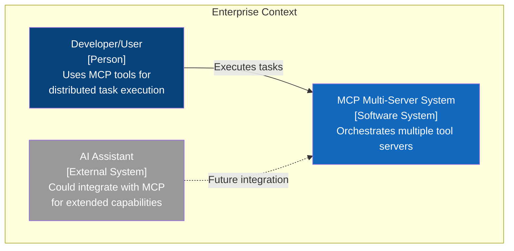
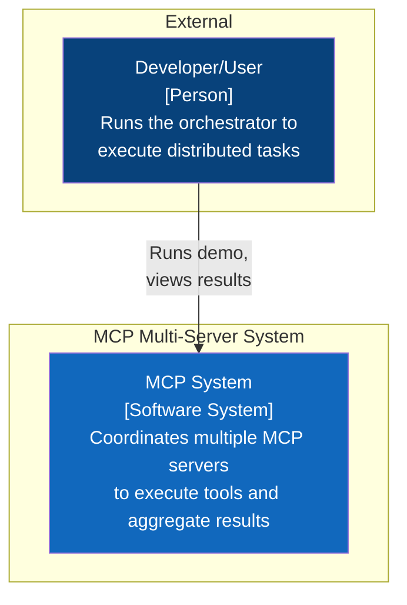
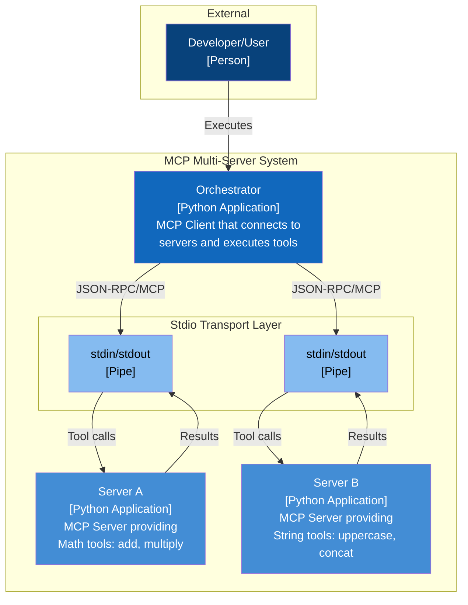
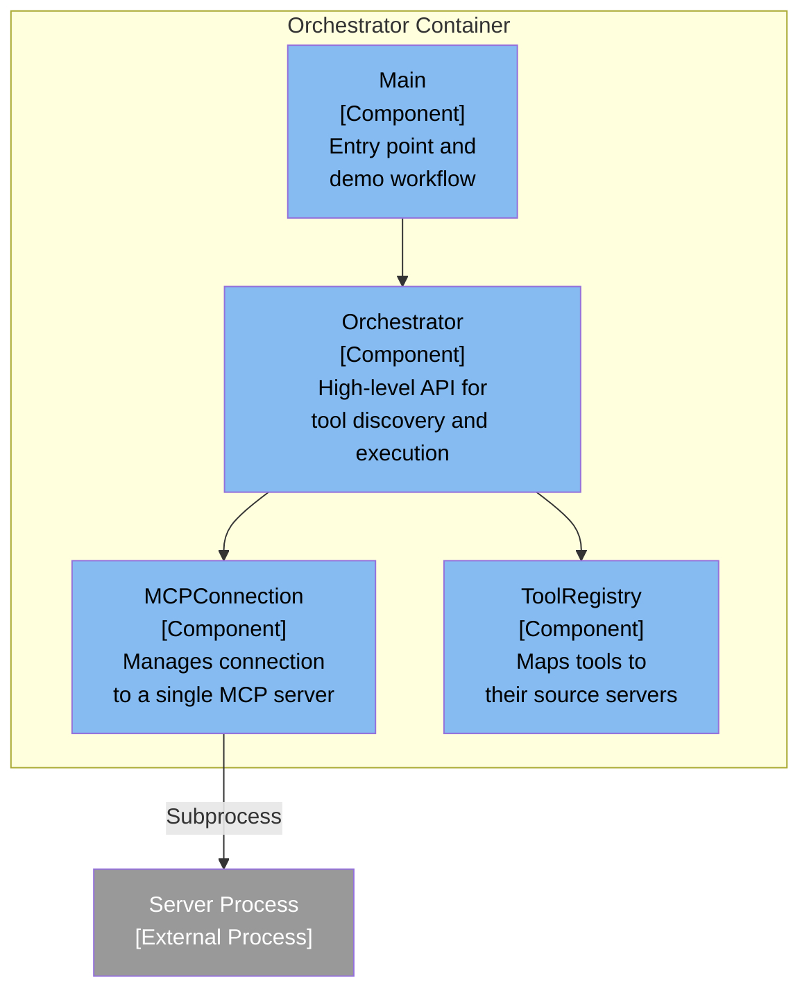
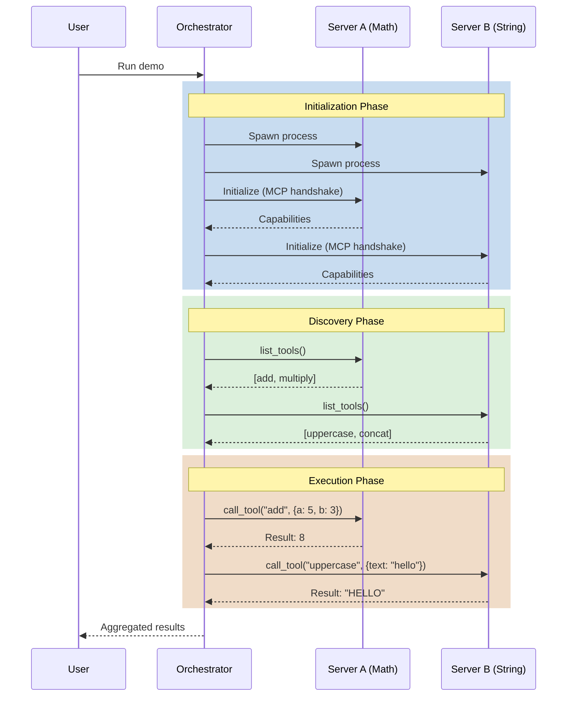
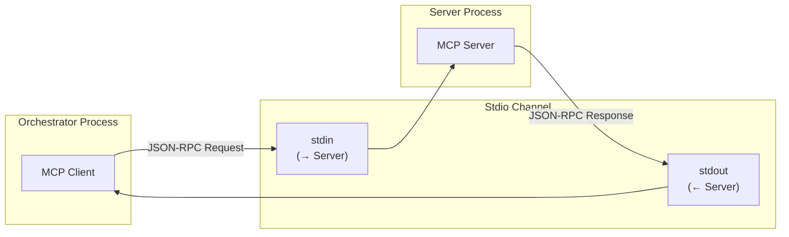
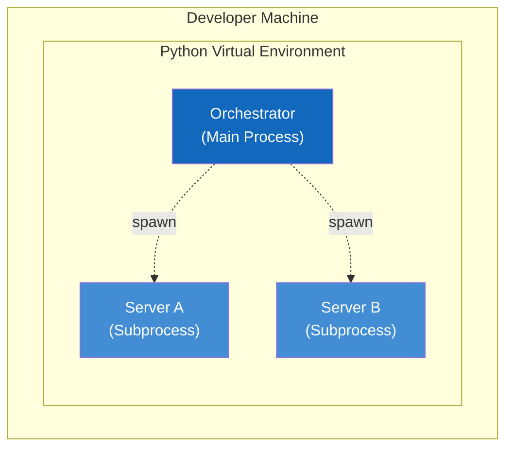

# C4 Model - MCP Multi-Server System

This document describes the system architecture using the C4 model notation with MermaidJS diagrams.

---

## Level 0: System Landscape Diagram

The System Landscape shows the broader context in which the MCP Multi-Server System exists.



### Landscape Description

| Element                 | Type            | Description                            |
| ----------------------- | --------------- | -------------------------------------- |
| Developer/User          | Person          | Primary user who runs the orchestrator |
| MCP Multi-Server System | Software System | The system being documented            |
| AI Assistant            | External System | Potential future integration point     |

---

## Level 1: System Context Diagram

The System Context diagram shows the MCP Multi-Server System and its interactions with external actors.



### Context Description

| Element        | Type            | Description                                                |
| -------------- | --------------- | ---------------------------------------------------------- |
| Developer/User | Person          | Executes the orchestrator to perform tasks using MCP tools |
| MCP System     | Software System | The complete system including orchestrator and servers     |

---

## Level 2: Container Diagram

The Container diagram shows the high-level components that make up the MCP System.



### Container Descriptions

| Container             | Technology            | Description                                                       |
| --------------------- | --------------------- | ----------------------------------------------------------------- |
| **Orchestrator**      | Python 3.10+, MCP SDK | Central client that manages server connections and tool execution |
| **Server A (Math)**   | Python 3.10+, MCP SDK | Exposes mathematical operations as MCP tools                      |
| **Server B (String)** | Python 3.10+, MCP SDK | Exposes string manipulation as MCP tools                          |
| **Stdio Transport**   | subprocess pipes      | Communication channel using stdin/stdout                          |

---

## Level 3: Component Diagram - Orchestrator



---

## MCP Communication Sequence



---

## Transport Layer Detail

The MCP protocol uses **JSON-RPC 2.0** over the stdio transport:



### Message Format Examples

**Request (Client → Server)**:

```json
{
  "jsonrpc": "2.0",
  "id": 1,
  "method": "tools/call",
  "params": {
    "name": "add",
    "arguments": { "a": 5, "b": 3 }
  }
}
```

**Response (Server → Client)**:

```json
{
  "jsonrpc": "2.0",
  "id": 1,
  "result": {
    "content": [{ "type": "text", "text": "8" }]
  }
}
```

---

## Deployment View



All components run locally within a single Python virtual environment. The orchestrator spawns the servers as subprocesses, which simplifies deployment and testing.
